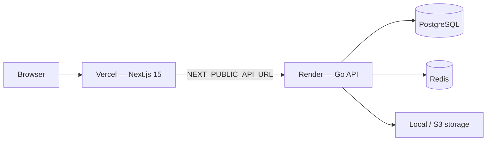
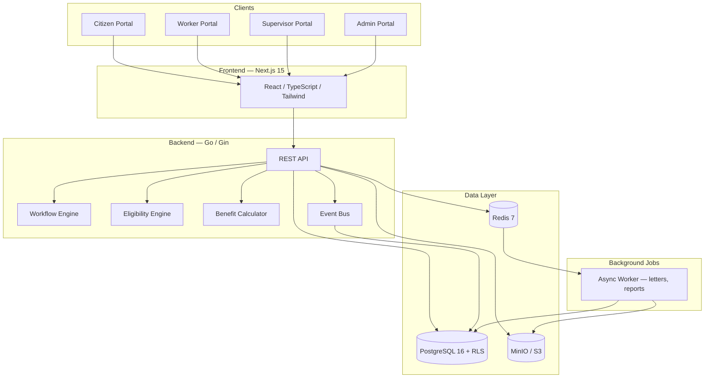
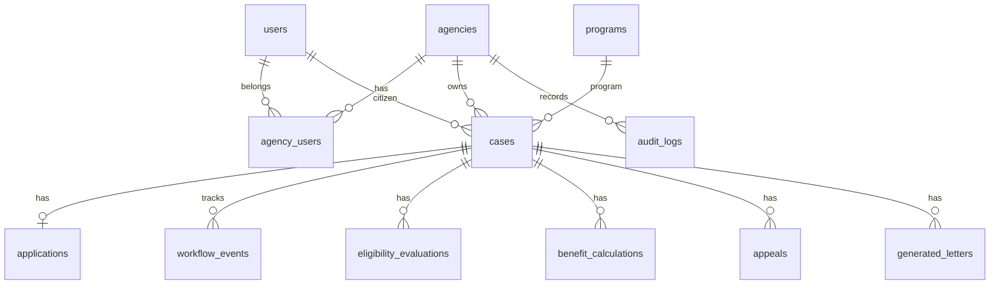

# Government Benefits & Case Management Platform

[Backend CI](https://github.com/yucheng1554439/gov-benefits-platform/actions/workflows/backend.yml)
[Frontend CI](https://github.com/yucheng1554439/gov-benefits-platform/actions/workflows/frontend.yml)
[License: MIT](LICENSE)
Go
Next.js
PostgreSQL
Docker

## Overview

A production-style government benefits administration platform inspired by California State and Los Angeles County case management systems.

Supports:

- Citizen applications
- Case management
- Eligibility evaluation
- Benefit calculation
- Appeals
- Audit logging
- Multi-tenancy
- RBAC
- Workflow engines

The system models a county benefits agency (LA County DPSS-style) with four role-based portals, immutable compliance audit trails, and a containerized deployment suitable for portfolio demonstrations and technical interviews.

---

## Live Demo

| Service | URL |
|---------|-----|
| **Frontend** | https://gov-benefits-platform.vercel.app |
| **Backend API** | https://gov-benefits-platform.onrender.com/api/v1 |
| **Health** | https://gov-benefits-platform.onrender.com/health |

Demo video: [YouTube walkthrough](https://youtu.be/CFBGj_Ofox0)

Password for all demo accounts: `Password123!` (see [Demo accounts](#3-demo-accounts) below).

---

## Deployment



| Platform | Role | Config |
|----------|------|--------|
| **Vercel** | Frontend hosting | Root: `frontend/` · Env: `NEXT_PUBLIC_API_URL` |
| **Render** | Backend API | Docker / Go build · Env: `DATABASE_URL`, `REDIS_URL`, `JWT_SECRET`, `CORS_ORIGIN`, storage vars |

Production environment audit: [docs/deployment-audit.md](docs/deployment-audit.md)

---

## Architecture




| Layer               | Role                                                                                                                      |
| ------------------- | ------------------------------------------------------------------------------------------------------------------------- |
| **Frontend**        | Next.js 15 SPA with role-based routing, multi-step intake wizard, case review UI, audit viewers, and analytics dashboards |
| **Backend**         | Go REST API with JWT auth, tenant middleware, workflow guards, rules evaluation, and domain event publishing              |
| **Database**        | PostgreSQL with row-level security, migrations, and immutable audit triggers                                              |
| **Storage**         | MinIO (S3-compatible) for document uploads and generated PDF letters                                                      |
| **Background jobs** | Redis-backed worker process for async letter generation and report jobs                                                   |


See [docs/architecture.md](docs/architecture.md) for component details and security model.

### Entity relationship (core)




Full schema notes: [docs/erd.md](docs/erd.md)

---

## Features

### Citizen Portal

- Apply for benefits
- Upload documents
- Track cases
- Download letters
- File appeals

### Worker Portal

- Review cases
- Evaluate eligibility
- Calculate benefits
- Fraud review

### Supervisor Portal

- Approve/deny cases
- Decide appeals
- Audit review

### Administrator Portal

- Users
- Rules
- Workflow
- Feature flags
- Analytics

---

## Tech Stack


| Layer              | Technologies                                               |
| ------------------ | ---------------------------------------------------------- |
| **Frontend**       | Next.js 15, TypeScript, Tailwind CSS, Recharts, React Flow |
| **Backend**        | Go, Gin, pgx, JWT, Prometheus                              |
| **Database**       | PostgreSQL 16 (RLS, migrations)                            |
| **Infrastructure** | Docker Compose, Redis 7, MinIO, Mailhog (dev)              |


---

## Screenshots


| Screen              | Preview                    |
| ------------------- | -------------------------- |
| Citizen Apply       | Citizen application wizard |
| Worker Review       | Worker case review         |
| Benefit Calculation | Benefit calculation        |
| Appeals             | Supervisor appeal review   |
| Audit Trail         | Audit trail                |
| Analytics           | Analytics dashboard        |


Capture instructions: [docs/screenshots/README.md](docs/screenshots/README.md)

---

## Demo Video

🎥 **Demo:** [https://youtu.be/CFBGj_Ofox0](https://youtu.be/CFBGj_Ofox0)

Automated headed walkthrough (Option A from [docs/demo-script.md](docs/demo-script.md)):

```powershell
npm run demo:install   # first time
npm run demo           # reset DB + Playwright recording script
```

---

## Quick Start

### 1. Start the stack

```bash
docker compose -f infra/compose/docker-compose.yml up --build
```


| Service       | URL                                            |
| ------------- | ---------------------------------------------- |
| Frontend      | [http://localhost:3000](http://localhost:3000) |
| API           | [http://localhost:8080](http://localhost:8080) |
| Mailhog       | [http://localhost:8025](http://localhost:8025) |
| MinIO console | [http://localhost:9001](http://localhost:9001) |


Copy environment template: `cp .env.example .env`

### 2. Seed demo data

```powershell
# Clean transactional data (preserves users, rules, workflows)
.\scripts\reset_demo_data.ps1

# Optional curated showcase cases (DEMO-A through DEMO-D)
.\scripts\seed_demo_data.ps1
```

### 3. Demo accounts

Password for all accounts: `**Password123!**`


| Role        | Email                                                                 |
| ----------- | --------------------------------------------------------------------- |
| Citizen     | [citizen1@example.com](mailto:citizen1@example.com)                   |
| Case Worker | [worker1@dpss.lacounty.gov](mailto:worker1@dpss.lacounty.gov)         |
| Supervisor  | [supervisor1@dpss.lacounty.gov](mailto:supervisor1@dpss.lacounty.gov) |
| Admin       | [admin@dpss.lacounty.gov](mailto:admin@dpss.lacounty.gov)             |


### 4. Verify

```powershell
.\scripts\run_demo_verification.ps1   # 16-step API workflow check
cd backend; go test -tags=integration ./tests/integration/...
```

---

## Project Structure

```
gov-benefits-platform/
├── backend/                 # Go API, worker, migrations, integration tests
│   ├── cmd/api/             # HTTP server entrypoint
│   ├── cmd/worker/          # Background job processor
│   ├── internal/            # Handlers, services, repositories, domain
│   └── migrations/          # SQL up/down migrations + seed data
├── frontend/                # Next.js 15 application
│   └── src/
│       ├── app/             # Role-based routes (citizen, worker, supervisor, admin)
│       ├── components/      # UI, case cards, appeals, workflow designer
│       └── lib/             # API client, auth, RBAC, hooks
├── infra/compose/           # Docker Compose (dev + prod overlay)
├── scripts/                 # Reset/seed SQL, demo verification, recording helpers
├── tests/e2e/               # Playwright demo + portfolio screenshot specs
└── docs/                    # Architecture, API spec, interview guides, audits
```

---

## Architecture Decisions

### Workflow engine

Case lifecycle is driven by configurable `workflow_transitions` per agency. Each transition specifies `from_status`, `to_status`, and `required_role`. The API validates transitions before updating case status and emits workflow events for the timeline and audit trail.

### Eligibility engine

Eligibility rules are stored as versioned JSON condition trees per program. The evaluator walks conditions (household size, income thresholds, etc.) and persists traceable results on each evaluation — supporting both API automation and worker UI review.

### Event bus

Domain actions publish in-process events (`case.status_changed`, `benefit.calculated`, `appeal.decided`, …). Subscribers handle audit logging, notifications, SLA updates, and async letter jobs without tight coupling between services.

### Multi-tenancy

Every tenant-scoped row carries `agency_id`. Isolation is enforced through JWT claims, validated `X-Agency-ID` headers, repository query filters, and PostgreSQL row-level security policies.

### Row-level security (RLS)

PostgreSQL RLS policies restrict reads and writes to the active agency context set at connection time. This provides defense-in-depth beyond application-layer filtering — a pattern common in regulated public-sector systems.

More detail: [docs/architecture.md](docs/architecture.md)

---

## Future Improvements


| Priority | Item                                                   |
| -------- | ------------------------------------------------------ |
| High     | Multi-agency switching with validated tenant context   |
| High     | Citizen document upload UI wired end-to-end            |
| Medium   | Email notifications via SMTP (Mailhog in dev)          |
| Medium   | CSV/PDF report generation jobs                         |
| Medium   | Backend enforcement of feature flags                   |
| Low      | Workflow designer write-back to production transitions |
| Low      | OpenAPI-generated client SDK                           |


Backlog source: [docs/implementation-audit-v2.md](docs/implementation-audit-v2.md)

---

## Documentation


| Document                                                  | Description                          |
| --------------------------------------------------------- | ------------------------------------ |
| [architecture.md](docs/architecture.md)                   | System design and security           |
| [erd.md](docs/erd.md)                                     | Entity relationships and status flow |
| [api-spec.yaml](docs/api-spec.yaml)                       | OpenAPI specification                |
| [demo-script.md](docs/demo-script.md)                     | Recorded demo click path             |
| [demo-readiness-report.md](docs/demo-readiness-report.md) | Verification status                  |
| [final-release-report.md](docs/final-release-report.md)   | Production pass/fail checklist       |
| [deployment-audit.md](docs/deployment-audit.md)           | Vercel/Render environment audit      |
| [program-display-fix.md](docs/program-display-fix.md)     | Worker queue program name fix        |
| [git-history-cleanup.md](docs/git-history-cleanup.md)     | Clean git history (remove Co-author) |
| [resume-summary.md](docs/resume-summary.md)               | Portfolio / resume bullets           |
| [interview-guide.md](docs/interview-guide.md)             | Likely interview Q&A                 |
| [github-release-review.md](docs/github-release-review.md) | Senior-engineer portfolio review     |


---

## Local Development

```bash
# Backend API
cd backend && go run ./cmd/api

# Background worker
cd backend && go run ./cmd/worker

# Frontend
cd frontend && npm install && npm run dev

# Unit tests
cd backend && go test ./...
```

Production overlay: `docker compose -f infra/compose/docker-compose.yml -f infra/compose/docker-compose.prod.yml up -d --build`

Health: `GET /health` (liveness) · `GET /ready` (PostgreSQL, Redis, MinIO)

---

## License

[MIT](LICENSE)