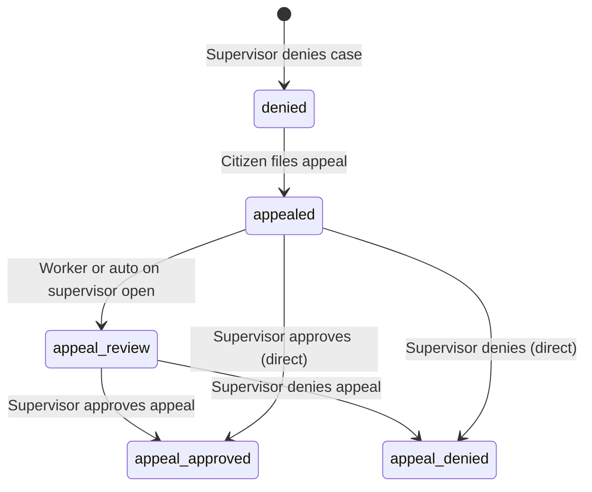

# Appeal Approval Workflow

This document describes the intended end-to-end appeal path in the Government Benefits Platform.

## Roles

| Role | Responsibility |
|------|----------------|
| **Citizen** | File an appeal on a **denied** case with written grounds |
| **Case Worker** | Monitor appeals queue; may move case to `appeal_review` (optional pre-step) |
| **Supervisor** | **Approve or deny appeals** — sole role with decision authority |
| **Admin** | Same decision authority as supervisor (via supervisor routes) |

## Status Flow



When a supervisor submits a decision via the UI:

1. Appeal record status → `decided`
2. Case workflow transitions (e.g. `appealed` → `appeal_review` → `appeal_approved`)
3. Workflow event recorded on the case timeline
4. Audit log entry `appeal.decided` created

## UI Path (Complete)

| Step | Actor | Route | Action |
|------|-------|-------|--------|
| 1. File appeal | Citizen | `/citizen/cases/{caseId}/appeal` | Submit grounds |
| 2. View queue | Worker | `/worker/appeals` | See pending appeals (read-only) |
| 3. Review & decide | **Supervisor** | **`/supervisor/appeals`** | **Approve Appeal / Deny Appeal** |
| 3 (alt.) | Supervisor | `/supervisor/cases/{caseId}` | Appeal Review panel on case detail |
| 4. Verify outcome | Citizen | `/citizen/cases/{caseId}` | Case status reflects decision |

## API

| Endpoint | Method | Role | Purpose |
|----------|--------|------|---------|
| `/appeals` | POST | Citizen | File appeal |
| `/appeals` | GET | Worker, Supervisor, Admin | Agency appeals queue |
| `/cases/{id}/appeals` | GET | All authorized | Appeals for one case |
| **`/appeals/{id}/decide`** | **POST** | **Supervisor, Admin** | **Record appeal decision** |

### Decision payload

```json
{
  "decision": "overturned",
  "rationale": "Income documentation supports eligibility."
}
```

| UI Label | `decision` value | Case outcome |
|----------|------------------|--------------|
| **Approve Appeal** | `overturned` | `appeal_approved` |
| **Deny Appeal** | `upheld` | `appeal_denied` |
| Remand for Review | `remanded` | Stays in `appeal_review` |

## Navigation

- **Supervisor sidebar:** Escalations → **Appeals** → Audit Trail
- Worker Appeals queue links to case detail for context; decisions are performed on **Supervisor → Appeals**
